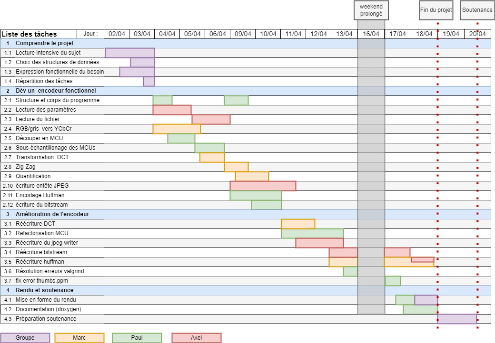

# team18

Membres : Paul Vernin, Axel Perrin, Marc Felix-Henry

[https://formationc.pages.ensimag.fr/projet/jpeg/jpeg/](https://formationc.pages.ensimag.fr/projet/jpeg/jpeg/).

# Expression fonctionnelle du besoin

## Lecture paramètre (stdin)

Prérequis : -

Entrée : `argv`

Sortie : `void`

Description : La fonction va réaliser les actions données en paramètre et remplir des variables globales\
(soit variables globales du fichier ppm2jpeg soit des variables passés en paramètre qu'on passera dans les autres fonctions qui en ont besoin)

## Lecture du fichier

Prérequis : Lecture paramètre

Entrée : `void` (variable global contenant nom du fichier ppm)

Sortie : `uint8_t[]` (tableaux contenant les pixels (data))

Description : La fonction lit le fichier ppm/pgm et va changer des variables globales en fonction de l'entête de l'image,  puis  il va lire la partie "data" et la mettre  dans un  tableau de `uint8_t[]` qu'il va retourner.

## Conversion RGB vers YCbCr

Prérequis : Lecture du fichier

Entrée : `*uint8_t[]`

Sortie : `void`

Description : Change  tous les pixels de RGB vers YCbCr. Si PGM rien à changer

## Découpage de l'image en MCUs

Prérequis : Conversion RGB vers YCbCr

Entrée : `uint8_t[]`

Sortie : `*mcu` (liste chainée de de `MCU` contenant des blocs Y, Cb, Cr)

Description : En fonction du fichier (PPM/PGM) découper les pixels en MCUs, en fonction de l'échantillonage le MCU contient 1, 2 ou 4 bloc (Y, Cr, Cb).

## Sous-échantillonnage de l'image

Prérequis : Découpage de l'image en MCUs

Entrée : `*mcu`

Sortie : `void`

Description : Dans chaque MCU, en  fonction  de l'échantillonage,  on va fusionner les Cb0, Cb1,... en un  unique Cb0 (pareil pour Cr). On fera  des free des anciens blocs pour pas gaspiller de la mémoire.

## Transformation DCT

Prérequis : Sous échantillonage de l'image

Entrée : `*mcu`

Sortie : `void`

Description : Module qui prend la liste de MCU et applique la DCT à chaque bloc de chaque MCU. Il va mettre les nouvelles valeurs dans les "freqential_bloc" de tailles int16_t.

## Zig-zag

Prérequis : Transformation DCT

Entrée : `*mcu`

Sortie : `void`

Description : Pour chaque frenquential_bloc de chaque mcu, crée un "vector_t" correspondant avec les valeurs triées en mode zig-zag

## Quantification

Prérequis : Zig-zag

Entrée : `*uint8_t[][64]`

Sortie : `void`

Description : applique les tableaux de quantification à chaque vecteurs.

## Codage DC et AC (RLE)

Prérequis : Quantification

Entrée : 

Sortie :

Description : 

## Encodage Huffman

Prérequis : Quantification

Entrée : 

Sortie :

Description : 

# Structures de données choisies

# Gantt

# Progression

- [ ] invader.pgm
- [ ] gris.pgm
- [ ] bisou.pgm
- [ ] complexite.pgm
- [ ] zig-zag.ppm
- [ ] thumbs.ppm
- [ ] horizontal.ppm
- [ ] vertical.ppm
- [ ] shaun_the_sheep.ppm
- [ ] biiiiiig.ppm
